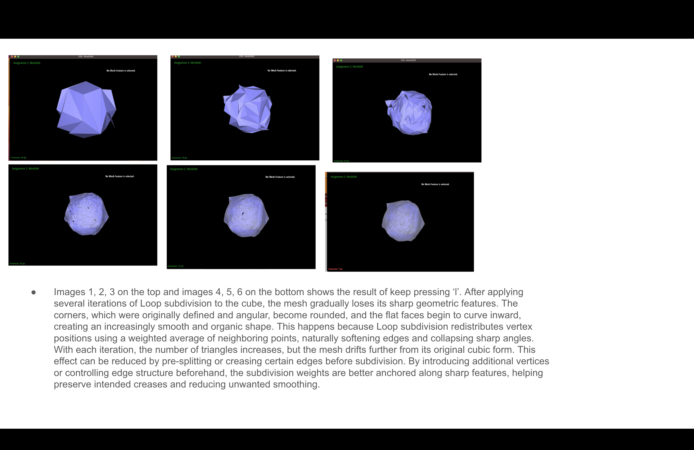
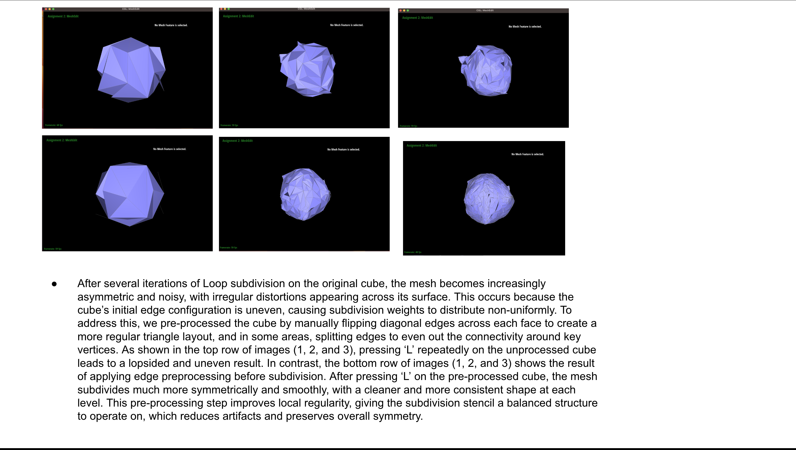

# CS184 Homework 2 – Write-Up (Jeffrey, Katrina)

This page documents our implementation and results for HW2, CS184
[View the full webpage here](https://jeffreylin888888.github.io/hw-webpages-su25/)

To have very high resolution words and images, please visit: https://docs.google.com/presentation/d/1zVNOSBosbC5QE_e61ApUIjSQhhVWLl8lyGq2js33MYk/edit?usp=sharing

We have all the write-up there, and we screenshotted them into this github webpage.

It took us around 40 hours to get through all six questions. 

Overview: For this project, we implemented a complete geometry processing pipeline using the half-edge data structure. We began by writing de Casteljau’s algorithm in both 2D and 3D to evaluate Bézier curves and surfaces, returning intermediate points at each level and ultimately the final evaluated point. We then implemented the surface evaluation for a Bézier patch by applying de Casteljau’s algorithm twice — once along the rows and then along the resulting column. Next, we computed per-vertex normals using area-weighted triangle normals around the one-ring neighborhood to get smooth shading. For mesh manipulation, we implemented edge flipping by carefully rewiring the local half-edge structure, and edge splitting by inserting a new vertex, creating six new half-edges and three new edges, and updating all connectivity. Finally, we completed Loop subdivision in the upsample function, which performs a full subdivision pass: updating vertex positions using the Loop formula, splitting all original edges, flipping edges connecting old and new vertices to maintain regularity, and updating vertex positions. The result is a progressively smoother surface that reflects the structure of Loop subdivision. Throughout the implementation, we carefully tracked and maintained mesh connectivity while ensuring each step followed the rules of the half-edge data structure.

## 📷 Slides

  
  
  
  
  
  
  

  

