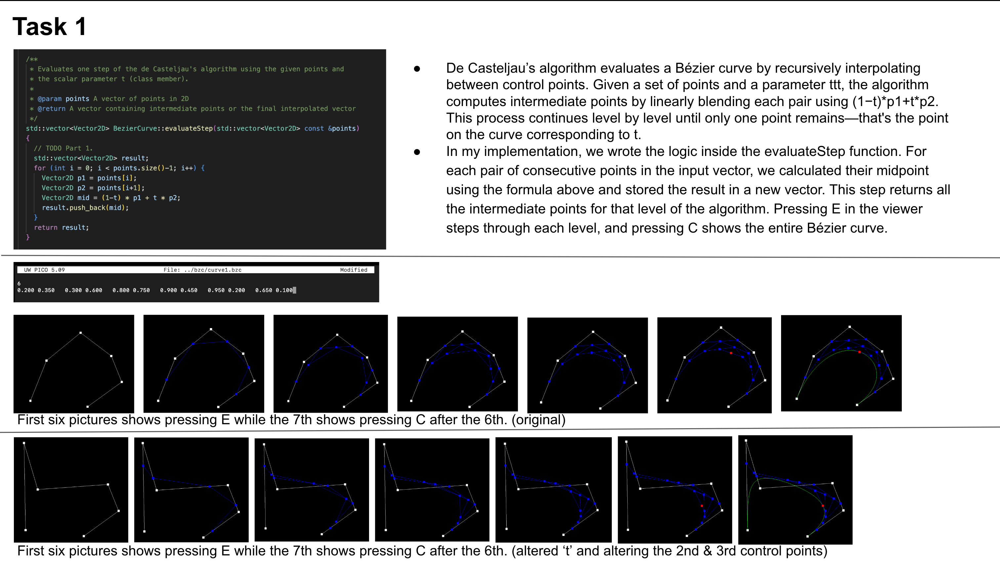
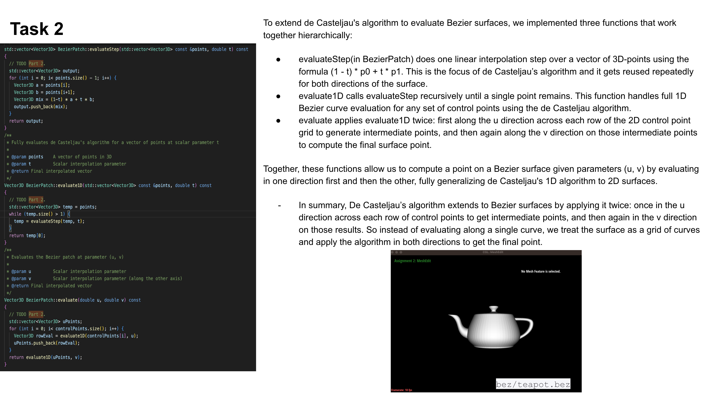
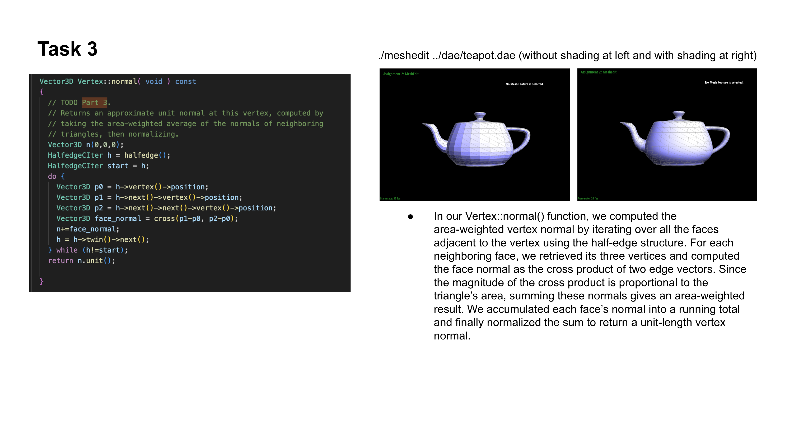
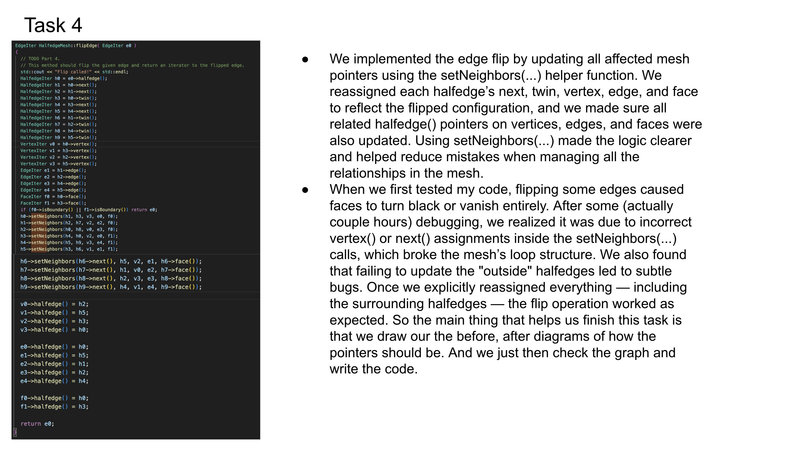
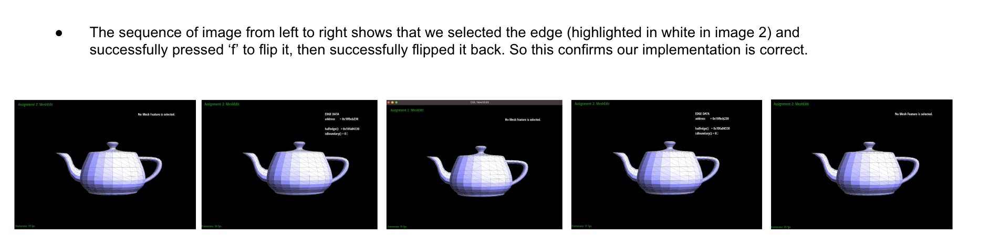
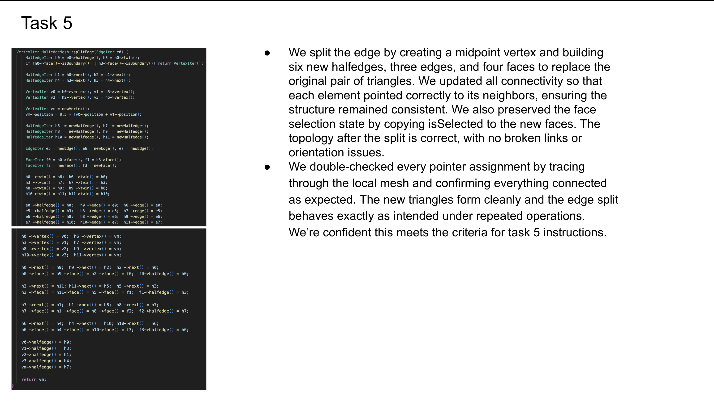
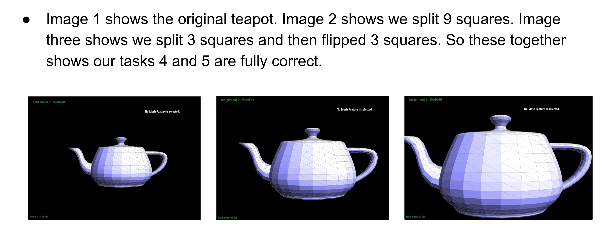
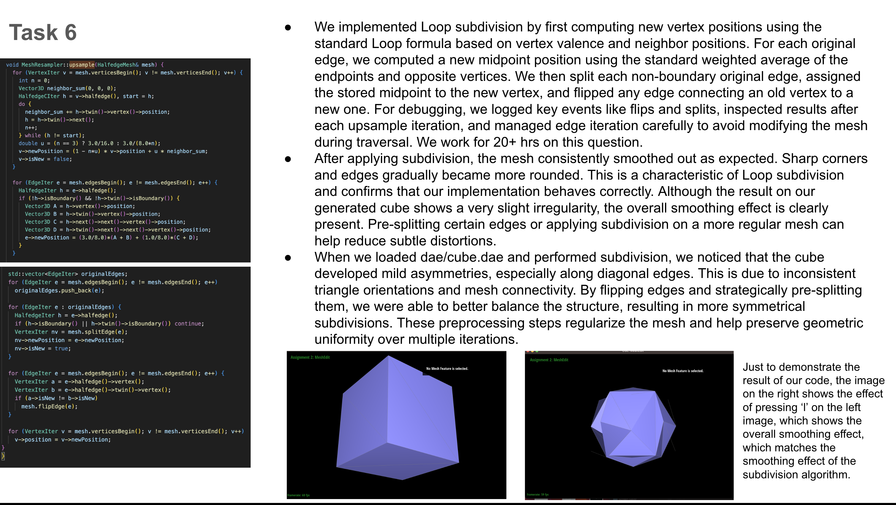

# CS184 Homework 2 – Write-Up (Jeffrey, Katrina)

This page documents our implementation and results for HW2, CS184

https://jeffreylin888888.github.io/hw-webpages-su25/hw2

To have very high resolution words and images, please visit: https://docs.google.com/presentation/d/1zVNOSBosbC5QE_e61ApUIjSQhhVWLl8lyGq2js33MYk/edit?usp=sharing

We have all the write-up there, and we screenshotted them into this github webpage.

It took us around 40 hours to get through all six questions. 

## 📷 Slides

  
  
  
  
  
  
  

