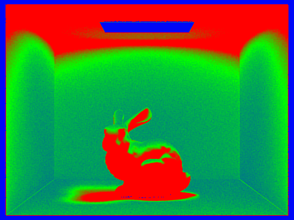
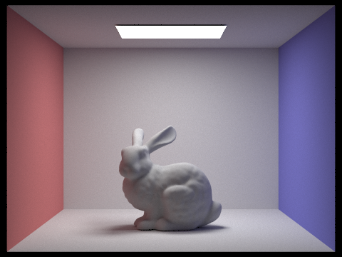
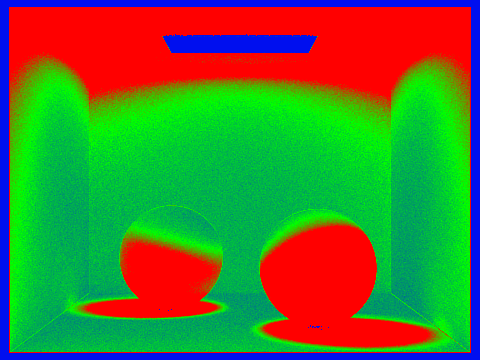

# https://jeffreylin888888.github.io/hw-webpages-su25/hw3
### Homework 3: Jeffrey Lin laa

###Some tables might be super long horiztonally, so please check using https://jeffreylin888888.github.io/hw-webpages-su25/hw3  Thank you.
### Overview: This assignment implements a physically-based path tracer that simulates realistic lighting through global illumination. I built the system step-by-step, from ray generation and BVH acceleration to direct lighting, indirect bounces, and adaptive sampling. It supports soft shadows, color bleeding, and multi-bounce diffuse effects in scenes with area lights and Lambertian materials. I spent over 50 hours on this project, and some parts—especially indirect lighting and Russian Roulette—were challenging to debug. I ran into issues like black outputs from missing BSDF cosine terms or incorrect recursion depth handling, but I fixed them through careful testing and visualization. The final results are smooth, efficient, and visually accurate, with clean convergence at high sample counts and adaptive sampling successfully concentrating effort where it matters most. Each bullet points represents my answer to the corresponding bullet-point in the write-up instructions in the cs184 website, but later bullet points might elaborate on previous bullet points.

### Note: I used ChatGPT solely to help check grammar and syntax in my write-up. All code, implementation decisions, and analysis were my own.

### Part 1

- In my path tracer, rays are generated from the camera using its intrinsic properties (like the field of view) and resolution. For each pixel on the image plane, I compute a direction vector from the camera center through that pixel using the camera-to-world transformation. This gives me the primary ray for that pixel, and I cast that into the scene to look for intersections. Once a ray is fired, it traverses the bounding volume hierarchy (BVH), which accelerates the search for potential geometry intersections. If a BVH node’s bounding box is hit, I descend recursively; otherwise, that entire subtree is skipped. When I reach a leaf node, I test the ray against the actual geometry (triangles, spheres, etc.) inside. If I find the closest intersection, I store the hit point, surface normal, and material info for shading.
  
- To test if a ray intersects a triangle, I used the Möller-Trumbore algorithm. The idea is to treat the triangle using its vertices v0, v1, v2, and solve for barycentric coordinates (b1, b2) and a parameter t along the ray direction such that: P=O=tD= (1-b1-b2)*v0 + b1v1 + b2v2. We solve this using cross products and dot products to avoid explicitly computing the triangle plane equation. If all conditions hold (e.g. b1,b2 ≥ 0 b1+b2≤1, t>0), we return a hit with barycentric coordinates, interpolated normals, and the distance t. If not, the ray misses the triangle. This method is efficient and doesn’t require computing the triangle normal up front, which is perfect for tight loops in ray tracing.

- To demonstrate my normal shading implementation, I rendered three different .dae scenes using the -f flag to generate PNG files, as required. For CBspheres, I ran ./pathtracer -r 800 600 -f CBspheres.png ../dae/sky/CBspheres_lambertian.dae. This scene includes two spheres inside the Cornell Box, and the smooth color gradients across the curved surfaces confirm correct normal interpolation. For the banana scene, I used ./pathtracer -r 800 600 -f banana.png ../dae/keenan/banana.dae. The resulting image shows smoothly varying colors along the banana’s organic curves, validating the accuracy of my normal shading. Lastly, I rendered cow.dae using ./pathtracer -r 800 600 -f cow.png ../dae/sky/cow.dae. The cow’s rounded features and continuous shading transitions further showcase the successful interpolation of surface normals.

<table>
  <tr>
    <td align="center">
       banana.png
    </td>
    <td align="center">
       CBspheres.png
    </td>
    <td align="center">
       cow.png
    </td>
  </tr>
</table>

### Part 2

<ul>
  <li>To construct the BVH, I implemented a recursive construct_bvh(...) function. At each level, I began by computing a bounding box that enclosed all primitives within the current range. If the number of primitives was less than or equal to max_leaf_size, I created a leaf node. Otherwise, I determined the axis with the largest extent (x, y, or z) of the bounding box, since splitting along the longest axis generally produces better spatial separation. I then computed the average of all primitive centroids along that axis and used it as the splitting point. After partitioning the primitives into left and right subsets, I recursively built child nodes. To avoid degenerate cases where all centroids fell on one side (leading to infinite recursion), I added a fallback: if a clean split couldn’t be made, I evenly divided the range. This method helped me achieve balanced trees and efficient ray traversal.

</li>
  <li>To demonstrate the effectiveness of BVH acceleration, I rendered three large .dae scenes with normal shading using the -f flag to output PNG files. These scenes would have been extremely inefficient to render without BVH due to their high geometric complexity. The first image, cblucy.png, contains a detailed Lucy statue inside a Cornell box, and I rendered it in just 0.0423 seconds at a speed of 4.729 million rays per second, thanks to efficient BVH traversal over its 170,392 primitives. The second, cbdragon.png, features the Stanford dragon with a complex mesh and microfacet materials, and I rendered it in 0.0431 seconds with an average speed of 2.83 million rays per second across 100,012 primitives. Lastly, I rendered maxplanck.png in 0.0889 seconds at a speed of 3.11 million rays per second, showing how BVH still improves performance even on moderately complex scenes with over 50,000 primitives.

</li>
</ul>

<table>
  <tr>
    <td align="center">
       cblucy.png
    </td>
    <td align="center">
       cbdragon.png
    </td>
    <td align="center">
       maxplanck.png
    </td>
  </tr>
</table>

<ul>
  <li>To evaluate the performance benefits of BVH acceleration, I rendered several moderately complex scenes — including cow.dae and maxplanck.dae — both with and without BVH. For the cow model (5,856 primitives), rendering with BVH completed in 0.0881 seconds, while rendering without BVH took 1.4986 seconds, showing a 17× speedup. Similarly, for the more complex maxplanck model (50,801 primitives), rendering with BVH took only 0.0644 seconds, while without BVH it required 15.6048 seconds — a dramatic ~240× speedup. Despite producing nearly identical visual results, I observed that BVH reduced the average number of intersection tests per ray from 2991.36 to 6.35 in the maxplanck scene. These results demonstrate that BVH acceleration significantly improves rendering performance, especially as scene complexity increases.

</li>
</ul>

 

<table>
  <tr>
    <td align="center">
       maxplanck_bvh.png
    </td>
    <td align="center">
       CBbunny_bvh.png
    </td>
    <td></td>
  </tr>
</table>

 

<table>
  <tr>
    <td align="center">
       cow_no_bvh.png
    </td>
    <td align="center">
       maxplanck_no_bvh.png
    </td>
    <td></td>
  </tr>
</table>

<h3>Part 3</h3>

<ul>
  <li>I implemented two versions of direct lighting: estimate_direct_lighting_hemisphere and estimate_direct_lighting_importance. The hemisphere version samples directions uniformly over the hemisphere around the surface normal and checks if each ray hits a light. It’s simple but inefficient since most directions don’t lead to a light source. The importance sampling version, on the other hand, samples directions directly from the lights using sample_L(...). I sent rays only toward actual light sources and weighted contributions by the BSDF, cosine term, and PDF. This led to much better results with fewer noisy samples, especially for area lights. In short: hemisphere sampling wastes samples, while importance sampling targets light directly and is far more efficient.

</li>
  <li>I rendered the same bunny scene using both uniform hemisphere sampling and importance sampling to compare the visual differences. At a low sample rate (1 light ray, 1 spp), importance sampling produced a brighter but noisier image because it concentrated samples toward the light source, while hemisphere sampling resulted in a darker image with a more uniform noise distribution. At higher sample rates (64 spp, 32 light rays), importance sampling yielded significantly smoother shadows and faster convergence, whereas hemisphere sampling remained darker with more visible noise. These results illustrated that importance sampling is more efficient at capturing direct lighting, especially as sample counts increase.

</li>
</ul>

<table>
  <tr>
    <td align="center">
       importantlowbunny.png
    </td>
    <td align="center">
       importanthighbunny.png
    </td>
    <td align="center">
       hemilowbunny.png
    </td>
    <td align="center">
       hemihighbunny.png
    </td>
  </tr>
</table>

<ul>
  <li>To evaluate the impact of light sampling on soft shadow quality, I rendered the bench.dae scene—containing at least one area light—using 1, 4, 16, and 64 light rays (via the -l flag), while keeping the number of samples per pixel fixed at 1 (-s 1). As expected, with only 1 light ray, the result was extremely noisy with sharp, grainy shadows. Increasing to 4 rays moderately reduced the noise, while 16 rays noticeably smoothed out the soft shadows. At 64 rays, the image appeared significantly less noisy, with soft shadows becoming more defined and realistic. These results demonstrated that increasing the number of light rays improves the accuracy of area light integration and reduces Monte Carlo variance, even when using a single camera sample per pixel. </li>
</ul>

<table>
  <tr>
    <td align="center">
       bench_l1.png
    </td>
    <td align="center">
       bench_l4.png
    </td>
    <td align="center">
       bench_l16.png
    </td>
    <td align="center">
       bench_l64.png
    </td>
  </tr>
</table>

<ul>
  <li>When comparing uniform hemisphere sampling and light sampling, I observed that uniform sampling produces much noisier results, especially in shadowed regions, because it wastes samples in unlit areas. Light sampling, on the other hand, concentrates samples toward the light source, leading to smoother shadows and faster convergence. This behavior held true even with higher samples per pixel, but the contrast was especially clear at low sample counts.

</li>
</ul>

<h3>Part 4</h3>

<ul>
  <li>To implement indirect lighting, I completed the at_least_one_bounce_radiance(...) function by recursively sampling indirect bounces using sample_f(...). After obtaining the sampled direction wi and its PDF, I traced a secondary ray and multiplied the returned radiance by the BSDF value and cosine term. I also incorporated Russian Roulette with a 0.3 survival probability once the ray depth dropped below max_ray_depth, allowing me to capture deeper light bounces while keeping the estimate unbiased and avoiding infinite recursion.

</li>
  <li>The following images demonstrate global illumination with both direct and indirect lighting, rendered at 1024 samples per pixel. In the CBbunny scene, the soft shadows beneath the bunny and the smooth shading across its surface highlight the contribution of indirect bounces, especially from the colored walls. Similarly, the CBspheres_lambertian scene exhibits noticeable color bleeding, with red and blue tones reflecting off the adjacent walls onto the white spheres. These results confirm that I correctly capture global illumination effects and produce realistic lighting with sufficient sampling.

</li>
</ul>
<table>
  <tr>
    <td></td>
    <td></td>
  </tr>
  <tr>
    <td align="center">CBbunny_global_fixed.png</td>
    <td align="center">CBspheres_lambertian_global.png</td>
  </tr>
</table>

<ul>
  <li>To compare direct and indirect illumination, I rendered the CBspheres_lambertian.dae scene at 1024 samples per pixel, modifying PathTracer::at_least_one_bounce_radiance to isolate each effect. In the direct illumination image, lighting comes only from the ceiling light, resulting in sharp shadows and dark unlit areas. The red and blue walls have no visible influence on nearby surfaces. In contrast, the indirect-only image lacks hard shadows but shows soft lighting and clear color bleeding from the walls onto the spheres and floor, highlighting how global illumination contributes subtle yet crucial realism through bounced light.

</li>
</ul>

<table>
  <tr>
    <td></td>
    <td></td>
  </tr>
  <tr>
    <td align="center">CBspheres_direct.png</td>
    <td align="center">CBspheres_indirect.png</td>
  </tr>
</table>

<ul>
  <li>I rendered CBbunny.dae at 1024 spp with four area-light samples in two configurations. In the un-accumulated mode (-o 0), which isolates only the mᵗʰ bounce, scene luminance drops steeply as m increases: the zero-bounce image is entirely black; the first-bounce image shows bright direct skylight; the second-bounce image adds strong red/blue wall-bleed; and by the third and higher bounces the contribution is essentially lost in noise. In the accumulated mode (-o 1), which sums contributions from bounce 0 through bounce m, overall brightness grows with each additional bounce, but the incremental increase diminishes rapidly: the transition from accum 1 to accum 2 yields the largest change (direct + colored indirect), whereas from accum 2 through accum 5 the extra fill is so subtle that it is only apparent when zoomed in for close inspection.Compared to rasterization, which lacks indirect bounces entirely, the 2nd bounce introduces vivid color bleeding from the red and blue walls, significantly enhancing the realism of the scene. The 3rd bounce, while weaker and noisier, still contributes faint secondary illumination that softens shadows and adds subtle ambient fill. These indirect bounces bring out visual richness and spatial coherence that rasterization cannot replicate, especially in enclosed environments like CBbunny.

</li>
</ul>

<table>
  <tr>
    <td></td>
    <td></td>
    <td></td>
    <td></td>
    <td></td>
    <td></td>
  </tr>
  <tr>
    <td align="center">CBbunny_unaccum0.png</td>
    <td align="center">CBbunny_unaccum1.png</td>
    <td align="center">CBbunny_unaccum2.png</td>
    <td align="center">CBbunny_unaccum3.png</td>
    <td align="center">CBbunny_unaccum4.png</td>
    <td align="center">CBbunny_unaccum5.png</td>
  </tr>
</table>

<table>
  <tr>
    <td></td>
    <td></td>
    <td></td>
    <td></td>
    <td></td>
    <td></td>
  </tr>
  <tr>
    <td align="center">CBbunny_accum0.png</td>
    <td align="center">CBbunny_accum1.png</td>
    <td align="center">CBbunny_accum2.png</td>
    <td align="center">CBbunny_accum3.png</td>
    <td align="center">CBbunny_accum4.png</td>
    <td align="center">CBbunny_accum5.png</td>
  </tr>
</table>

<ul>
  <li>I rendered CBbunny.dae at 1024 spp with 4 light samples and Russian‐roulette (continuation probability 0.6) for max_ray_depth m = 0, 1, 2, 3, 4, and 100. At m = 0 the scene is completely black (no bounces). At m = 1 the floor and bunny glow brightly under the skylight (direct lighting only). At m = 2 you start to see a weak red and blue tint from the walls (“color bleed”) as light bounces once off a colored wall before reaching the surfaces. At m = 3 and m = 4 each additional bounce adds only a faint soft‐fill lift in the shadows, so the image brightens very little beyond m = 2—but the subtle shadow softening makes the bunny look progressively more natural. By m = 100 you’ve effectively captured the full diffuse global illumination—mean scene brightness matches m = 4, but the lighting is as realistic as diffuse GI allows (with only Monte Carlo noise from the roulette termination).

</li>
</ul>
<table>
  <tr>
    <td></td>
    <td></td>
    <td></td>
    <td></td>
    <td></td>
    <td></td>
  </tr>
  <tr>
    <td align="center">CBbunny_rr0.png</td>
    <td align="center">CBbunny_rr1.png</td>
    <td align="center">CBbunny_rr2.png</td>
    <td align="center">CBbunny_rr3.png</td>
    <td align="center">CBbunny_rr4.png</td>
    <td align="center">CBbunny_rr100.png</td>
  </tr>
</table>

<ul>
  <li>I rendered the lambertian spheres scene at 480×360 with 4 light rays, 5 bounces, and 8 threads using 1, 2, 4, 8, 16, 64 and 1024 spp. At 1 spp it’s almost pure noise—no shape is clear. At 2 spp you can just make out the spheres’ silhouettes. At 4 spp the spheres and basic wall-bleed appear, but heavy grain remains. At 8 spp and 16 spp the major lighting and color bleed are visible with moderate noise. At 64 spp the image is almost smooth—with only faint speckle in shadows. At 1024 spp it’s essentially noise-free, showing crisp edges, accurate diffuse color bleed, and full global illumination.
</li>
</ul>
<table>
  <tr>
    <td></td>
    <td></td>
    <td></td>
    <td></td>
    <td></td>
    <td></td>
    <td></td>
  </tr>
  <tr>
    <td align="center">Spheres_s1.png</td>
    <td align="center">Spheres_s2.png</td>
    <td align="center">Spheres_s4.png</td>
    <td align="center">Spheres_s8.png</td>
    <td align="center">Spheres_s16.png</td>
    <td align="center">Spheres_s64.png</td>
    <td align="center">Spheres_s1024.png</td>
  </tr>
</table>

### Part 5

<ul>
  <li>I implemented adaptive sampling entirely inside raytrace_pixel(), replacing the fixed‐count loop with a while that fires up to ns_aa camera rays but checks convergence every samplesPerBatch samples. Each new radiance sample L adds its illuminance iv = L.illum() into running sums s1 and s2, so I can compute the mean μ = s1/n and variance σ² = (s2–s1²/n)/(n–1) on the fly. After every batch I form the 95% confidence half-width I = 1.96·σ/√n and, if I ≤ maxTolerance·μ, I break out early. Finally I write the pixel’s average color and the actual sample count into the buffers, which yields a clean image plus a heatmap showing exactly how many samples each pixel needed.
</li>
    <li>I rendered CBbunny.dae and CBspheres_lambertian.dae at 2048 spp with adaptive sampling (64 batch, 5% tol), one light ray, and five bounces. Each noise-free image is paired with its rate-map: the flat floor and side walls are solid green (low-variance pixels that converged quickly), the skylight opening’s center is deep blue (pixels that finished in the first batch) while the surrounding ceiling is bright red (high-variance pixels that ran to the 2048 spp limit), and both object silhouettes and their contact shadows glow red as well. This clearly demonstrates that adaptive sampling concentrates rays on edges and shadow boundaries while saving effort on uniformly lit areas.

</li>
</ul>
<table>
  <tr>
    <td></td>
    <td></td>
  </tr>
  <tr>
    <td align="center">CBbunny_adapt_rate.png</td>
    <td align="center">CBbunny_adapt.png</td>
  </tr>
</table>

<table>
  <tr>
    <td></td>
    <td></td>
  </tr>
  <tr>
    <td align="center">CBspheres_adapt.png</td>
    <td align="center">CBspheres_adapt_rate.png</td>
  </tr>
</table>
