## Task 1: Drawing Single-Color Triangles (We did extra credit part for this)

- To rasterize a triangle, we first computed its axis-aligned bounding box. Then, for each pixel that is centered within that bounding box, we check whether it lies inside the triangle using edge functions based on the triangle's vertices. If a pixel passes all edge tests, we fill it with the appropriate color.

- My algorithm ensures correctness because the bounding box is the minimum rectangle enclosing the triangle. Although we test every pixel inside the box, the edge function method ensures only pixels truly inside the triangle are drawn. Therefore, our approach is just as accurate as sampling every point inside the bounding box.

- To speed up triangle rasterization, we applied the following optimizations:
  - Precomputed the constants for the edge functions (A, B, C) to avoid redundant arithmetic within the inner loop.
  - Used a tight bounding box via floor and ceil to limit the number of pixels tested.
  - Used the signs of the edge functions to quickly determine whether a sample lies within the triangle.
  - Added a bounds check before calling `fill_pixel` to avoid unnecessary memory access.
  
  These optimizations significantly reduced render time—from around 1.35 ms to 0.62 ms for `test4.svg`—resulting in roughly a 2× speedup.

### Screenshot of `test4.svg`
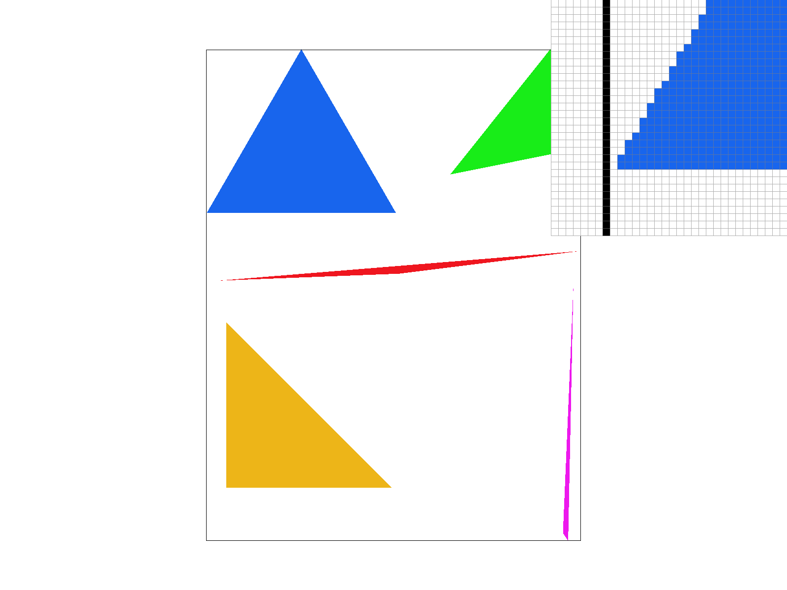

### Code Snippets
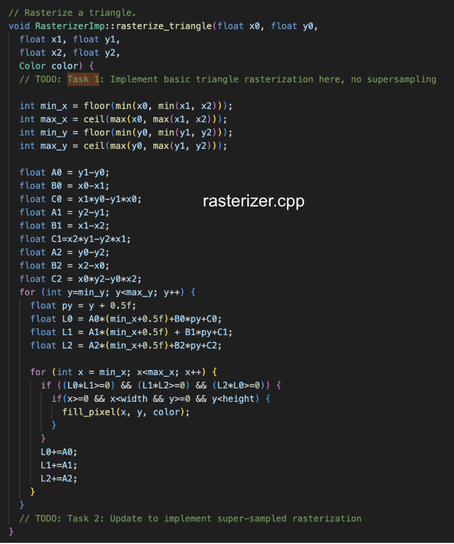
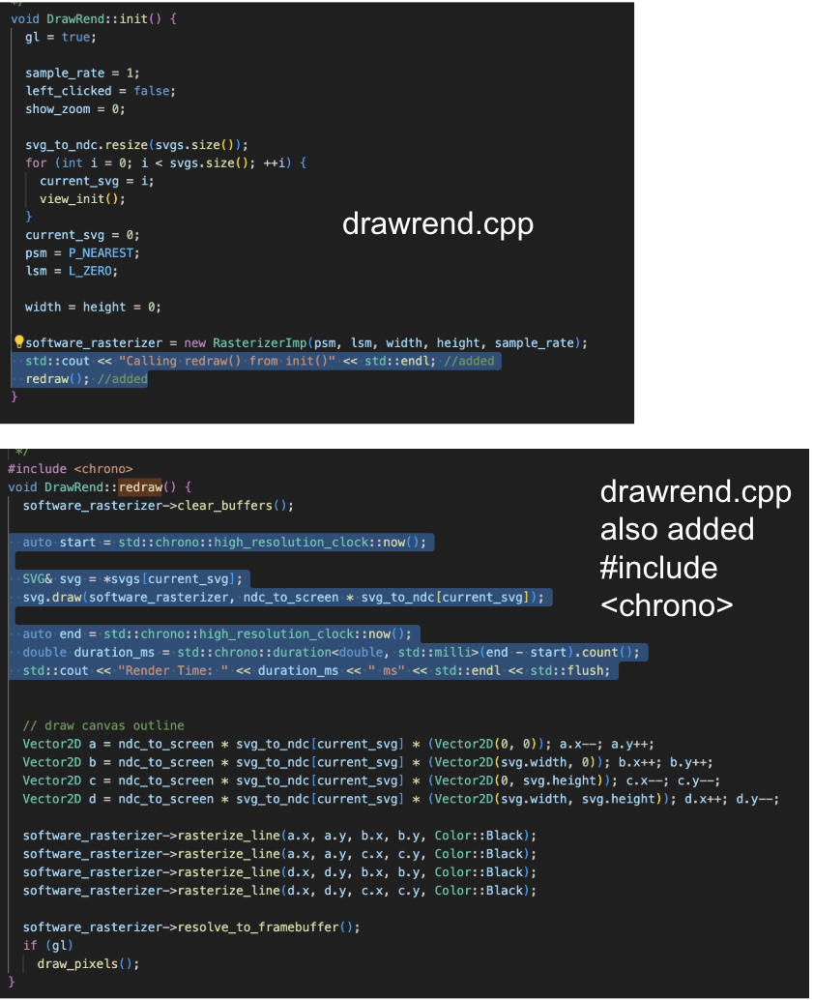

### Timing Comparison
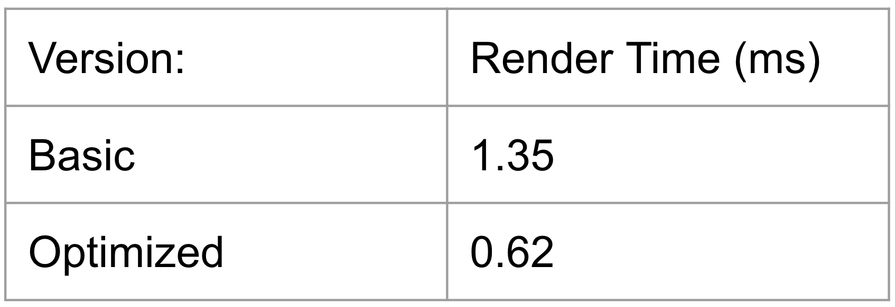

## Task 2: Antialiasing by Supersampling (We did extra credit part for this)

- We implemented supersampling by maintaining a 1D sample_buffer(our data structure), where each pixel contains multiple color samples—this buffer scales with width × height × sample_rate. Supersampling is useful because it captures sub pixel geometry detail. Instead of each pixel being represented by a single sample, we averaged across multiple hits to smooth aliasing at triangle edges. This method allows for high-frequency details like sharp triangle corners to be reconstructed with much smoother transitions, which significantly reduces jagged lines and stair-step effects.
  
- In rasterize_triangle(), we added two nested loops to iterate over subpixel positions within each pixel, and used jittered(we use the normal and also the extra credit jitter) offsets for anti-aliasing (i.e., stratified random sampling inside each subgrid cell). We modified fill_pixel() and resolve_to_framebuffer() to write to and read from the sample_buffer appropriately—filling each sub-slot independently, then averaging during the final resolve step. We also updated set_sample_rate() and set_framebuffer_target() to size correctly the sample_buffer based on the sample_rate, to ensure that memory is always allocated for all sub-samples across the image.
  
- For each pixel, we evaluated barycentric coverage at several subpixel sample locations—only those that pass the triangle test were filled with color, which smooths edge transitions. We used jittered sampling to vary subpixel positions randomly within subcells, preventing structured grid aliasing and improving the smoothness of the triangle edges. The final color of each pixel is computed as the average of all its subpixel samples, which naturally blends edges where only a portion of the pixel is covered by the triangle.

- For the normal, original implementation (meaning no jitter), the results are as follows: at sample rate 1, the pixels change color abruptly, forming jagged edges. At 4 and 16, the edge transitions appear more gradual due to the averaging of multiple subpixel samples. So as we go from 1 to 4 to 16 in the sample rate, less aliasing occured. (Pictures will be shown two paragraphs below along with jitter.)

- To earn extra credit, we implemented jittered supersampling by generating random subpixel offsets within a stratified grid. Each sample is jittered within its grid cell to avoid regular pattern repetition. Jittered sampling reduces structured aliasing artifacts that grid-based supersampling can’t fully eliminate. This is noticeable in the smoother edge transitions and reduced moiré patterns along triangle boundaries. Comparing the side-by-side screenshots, jittered sampling (especially at 16 samples) shows a more natural gradient and softer transitions than the regular grid approach, particularly at tight angles and intersections. (Pictures are below along with regular ones, a total of 6)

### Supersampling Comparison (No Jitter top to bottom corresponding to 1, 4, then 16 sample rate)
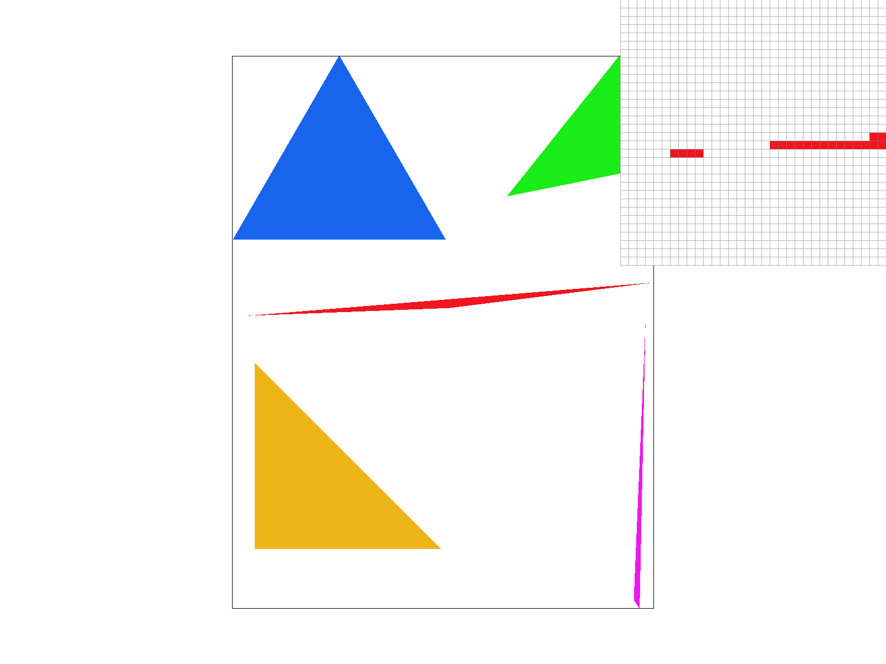
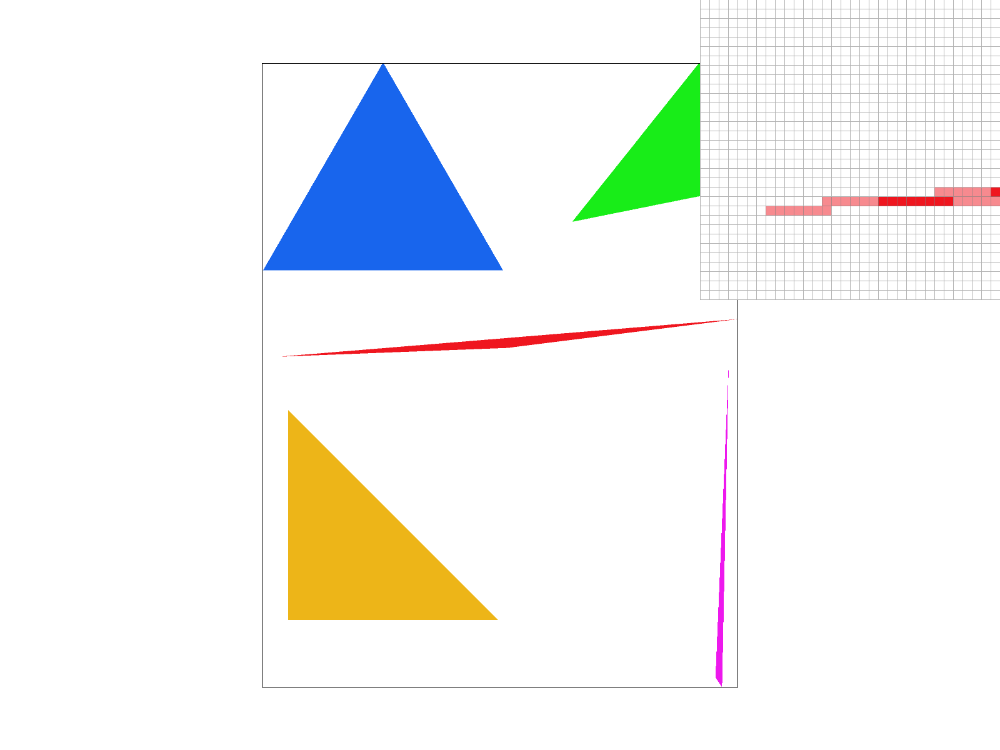
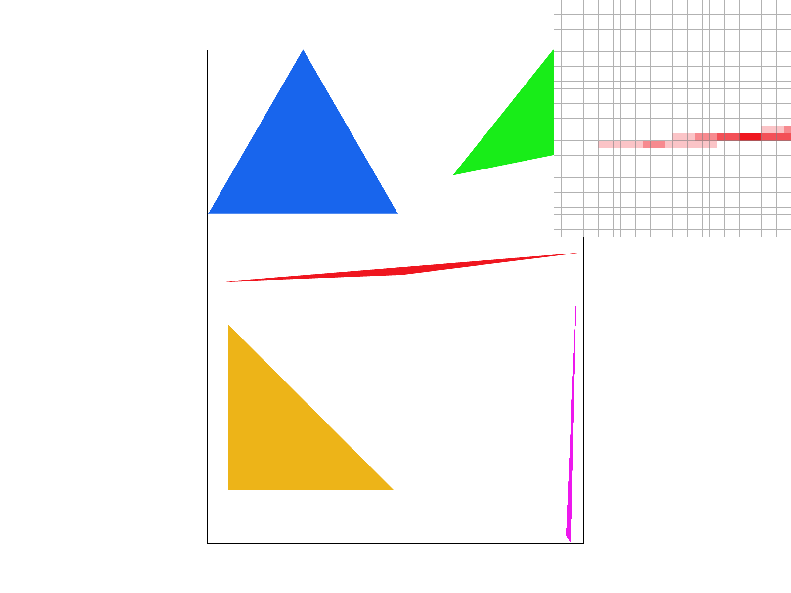

### Supersampling Comparison (With Jitter top to bottom corresponding to 1, 4, then 16 sample rate)

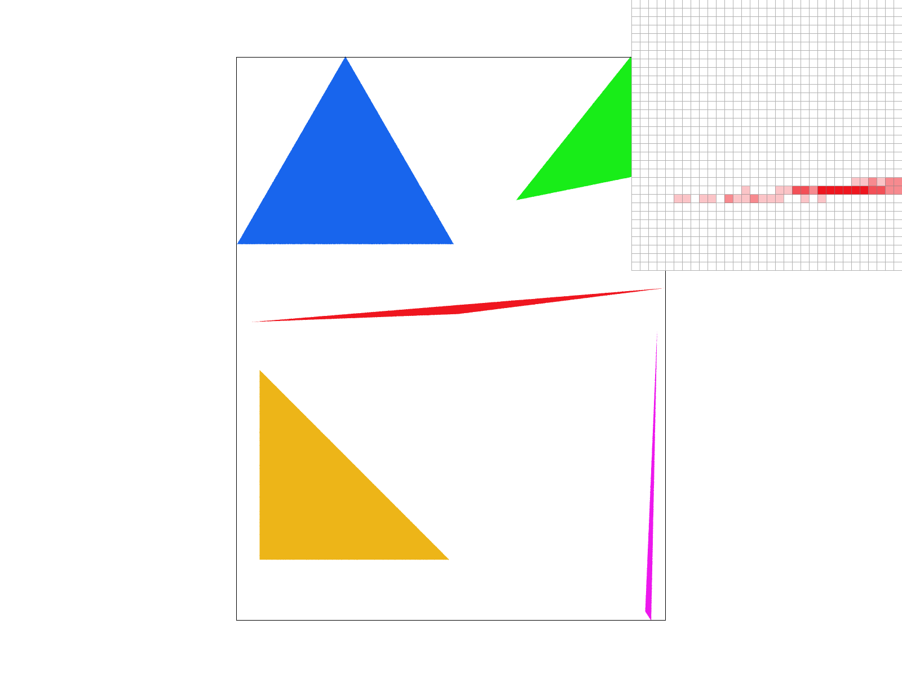
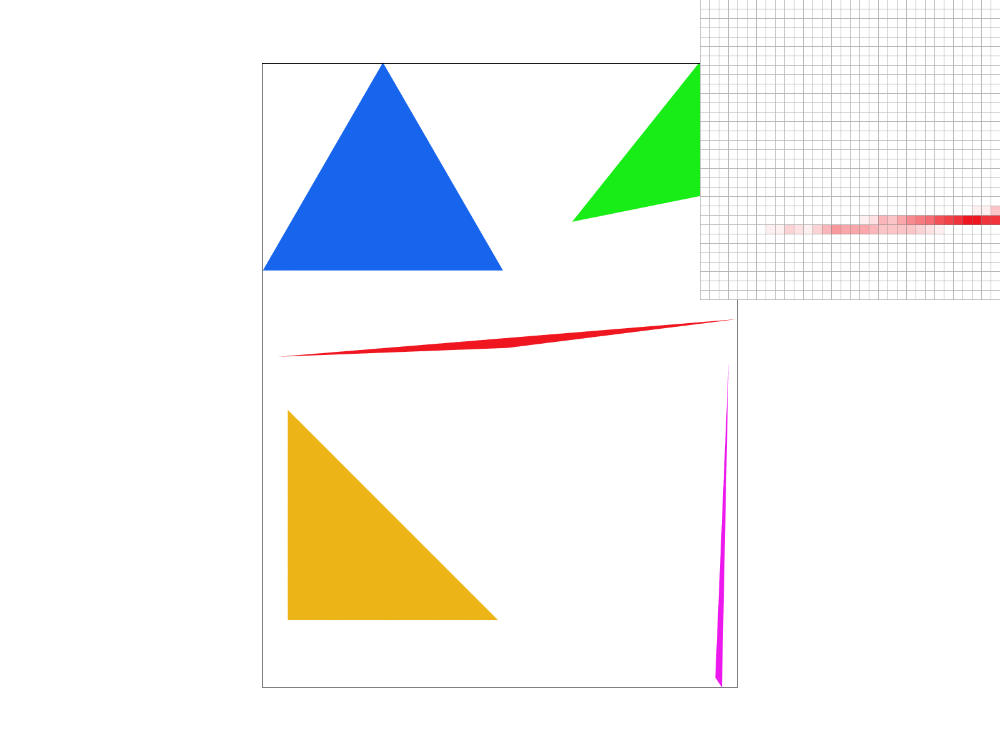

### Code Snippets
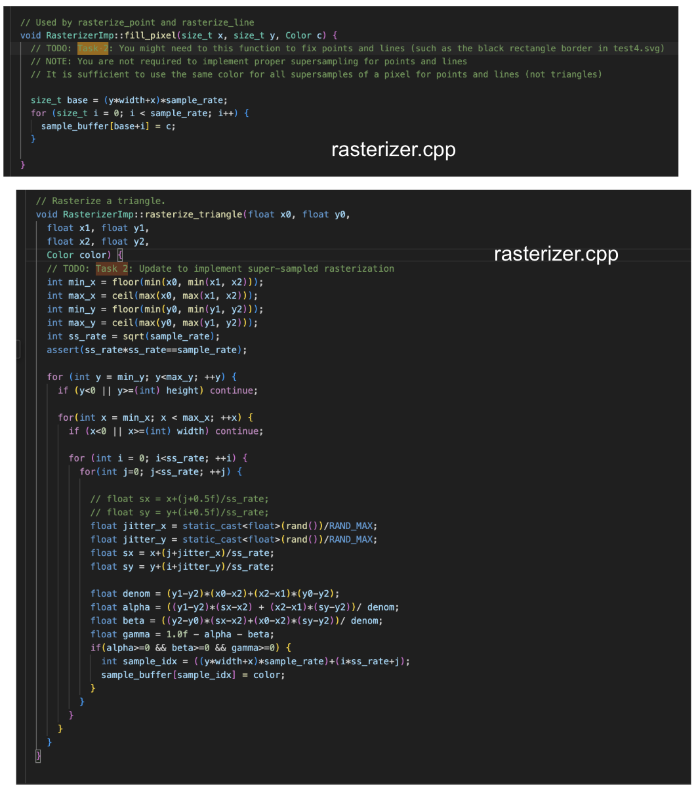
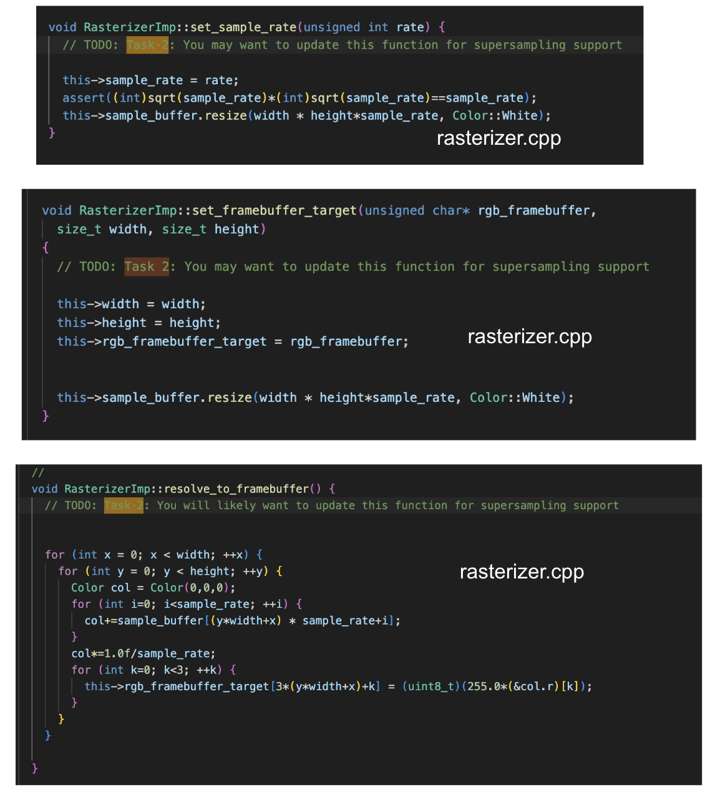

## Task 3: Transforms

- In Task 3, we implemented the SVG transforms—translate, scale, and rotate—using 3x3 homogeneous coordinate matrices in transforms.cpp following the SVG specification. Translation shifts elements by updating the matrix’s last column, scaling adjusts element sizes along the x and y axes by modifying the diagonal, and rotation uses the standard 2D rotation matrix with angles converted from degrees to radians. To test these transforms, I modified the provided robot.svg into my_robot.svg by applying a rotation transform to the robot’s left arm group, creating a static waving pose. Running the renderer with my updated SVG showed the robot waving its left hand correctly, confirming that the transforms work as intended and can be combined hierarchically to create more complex shapes and animations. (Picture or robot is directly below here.)

### Robot Static Waving Left Arm
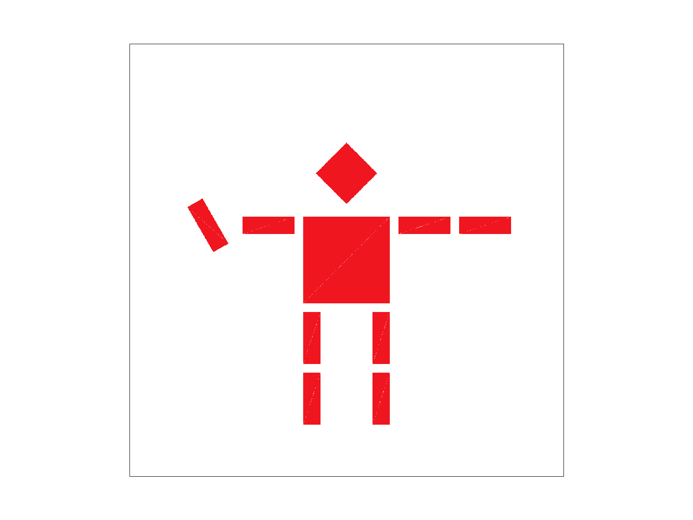

### Code Snippets
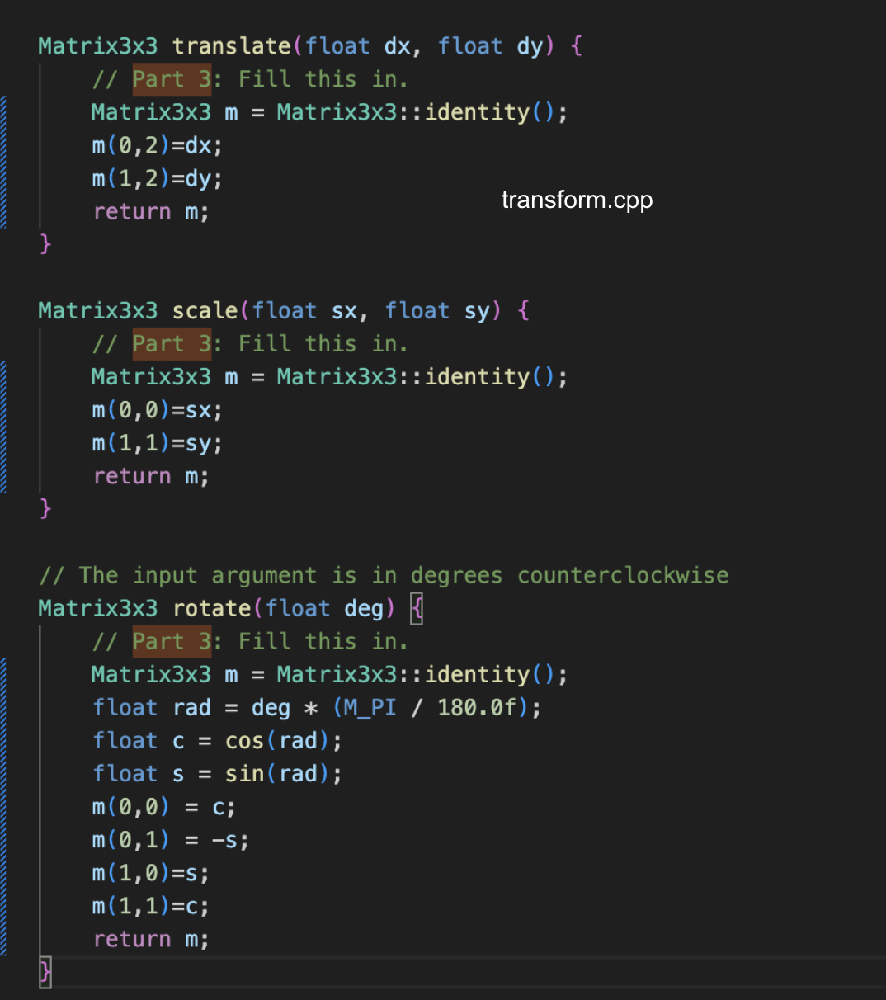
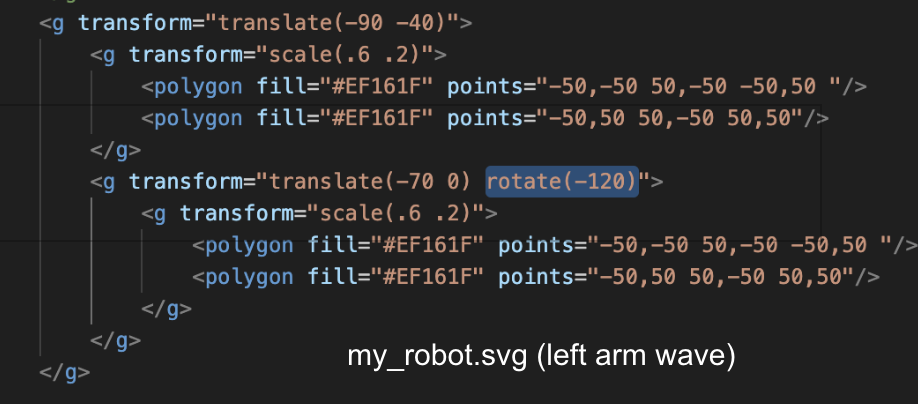

dc
