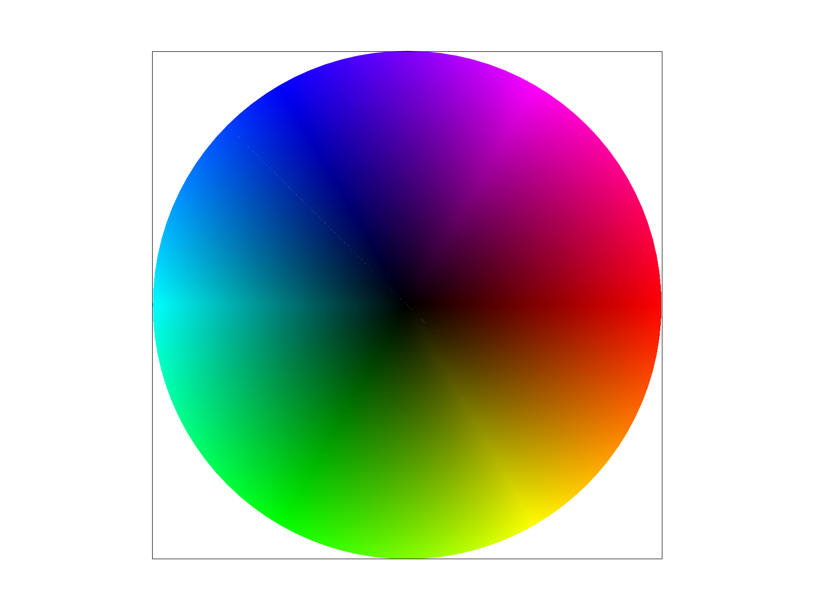
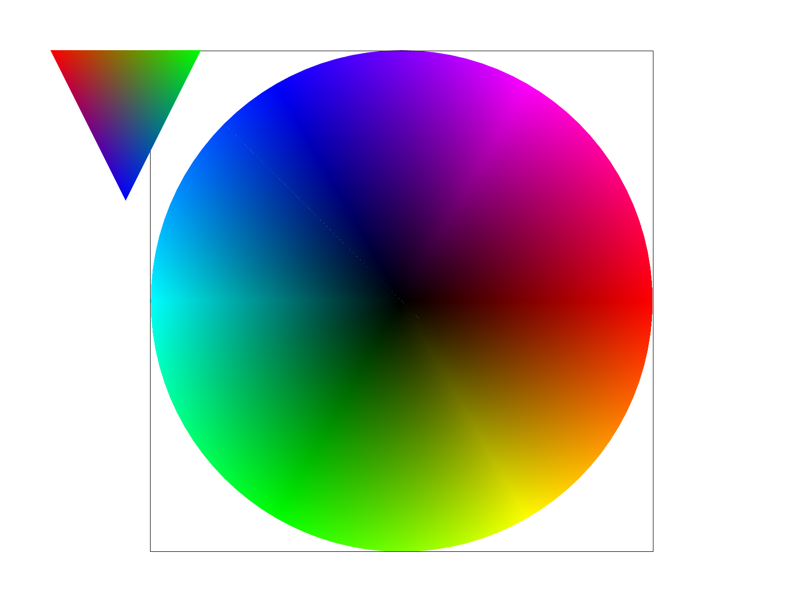
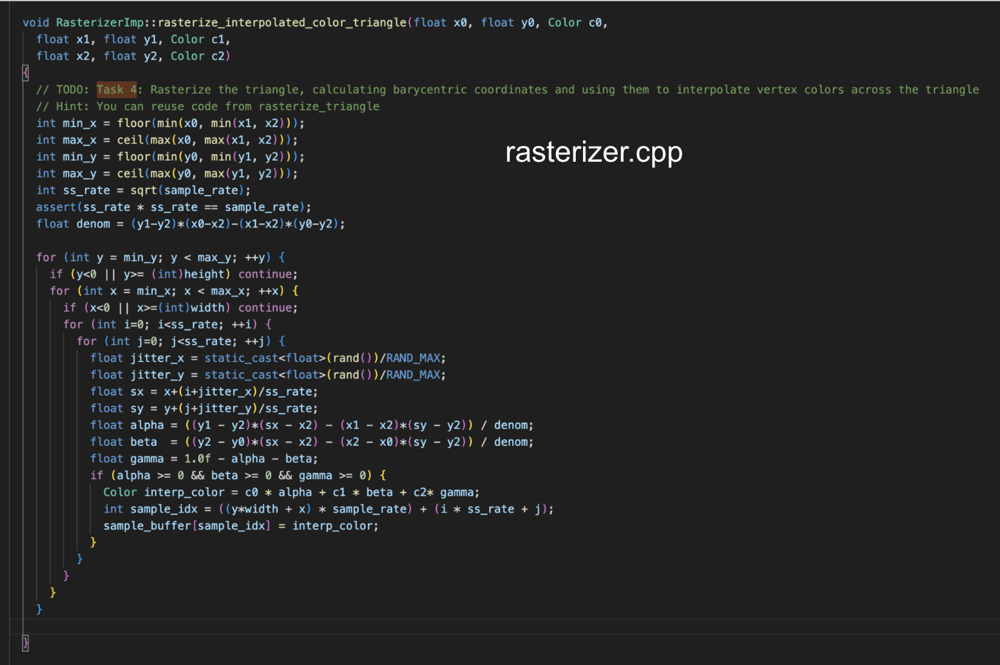
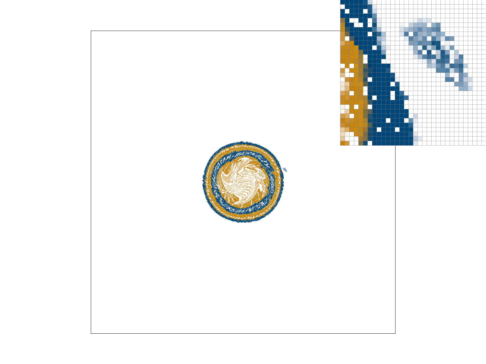
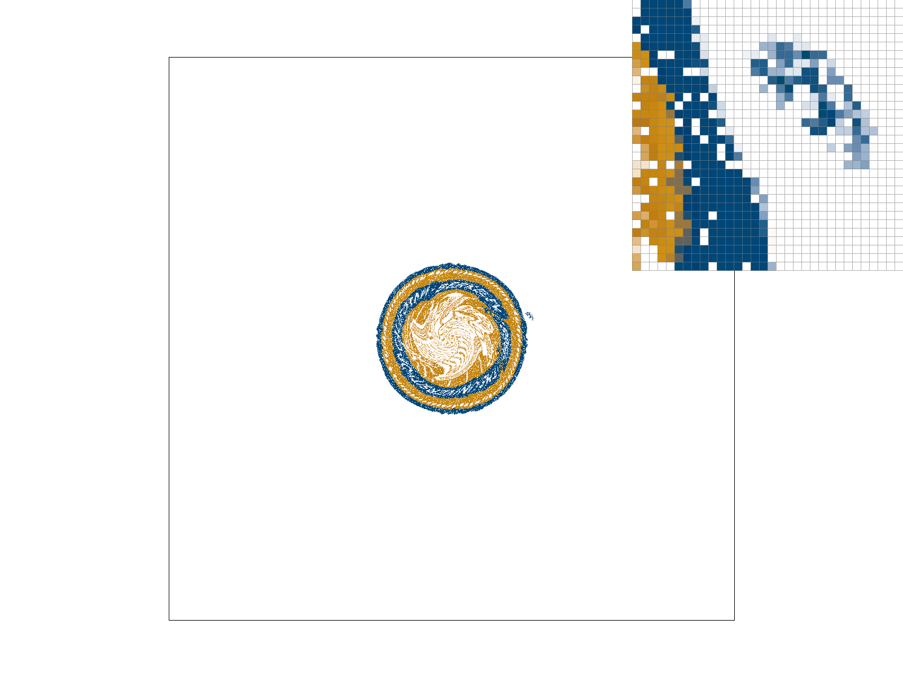
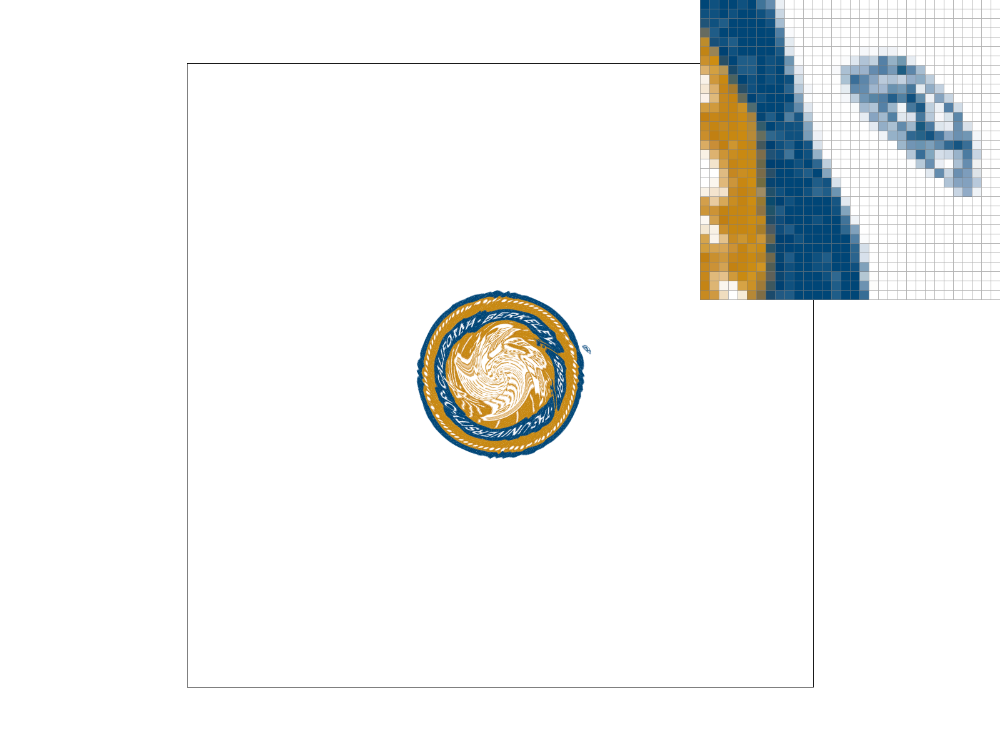
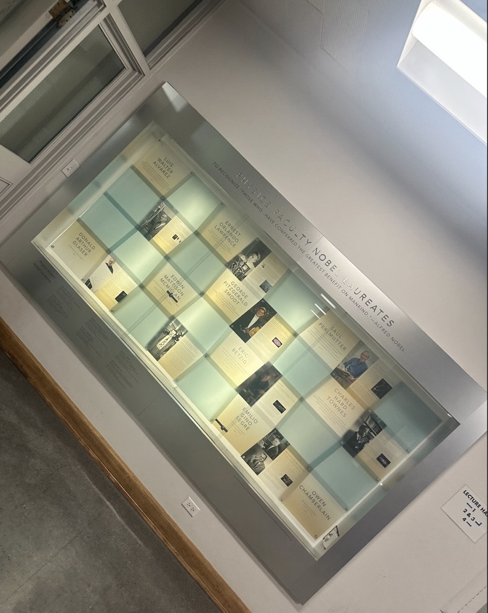
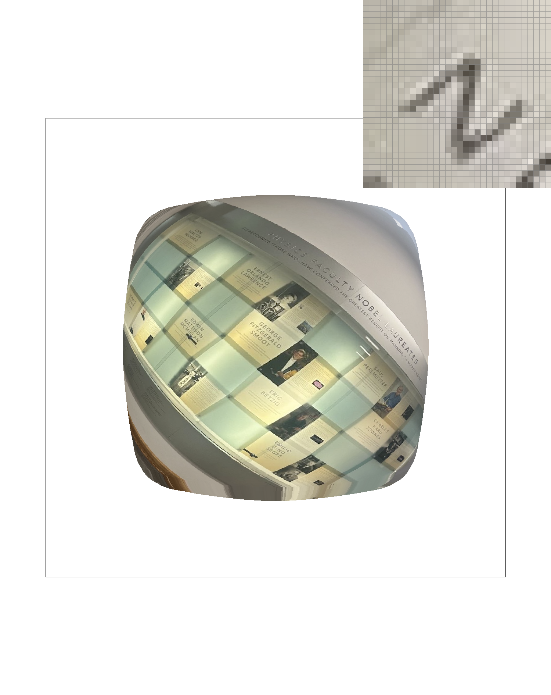

## Link to webpage: https://jeffreylin888888.github.io/hw-webpages-su25/

## Task 1: Drawing Single-Color Triangles (We did extra credit part for this)

- To rasterize a triangle, we first computed its axis-aligned bounding box. Then, for each pixel that is centered within that bounding box, we check whether it lies inside the triangle using edge functions based on the triangle's vertices. If a pixel passes all edge tests, we fill it in with the appropriate color.

- Our algorithm ensures correctness because the bounding box is the minimum rectangle enclosing the triangle. Although we test every pixel inside the box, the edge function method ensures only pixels truly inside the triangle are drawn. Therefore, our approach is just as accurate as sampling every point inside the bounding box.

- To speed up triangle rasterization, we applied the following optimizations:
  - Precomputed the constants for the edge functions (A, B, C) to avoid redundant arithmetic within the inner loop.
  - Used a tight bounding box via floor and ceil to limit the number of pixels tested.
  - Used the signs of the edge functions to quickly determine whether a sample lies within the triangle.
  - Added a bounds check before calling `fill_pixel` to avoid unnecessary memory access.
  
  These optimizations significantly reduced render time—from around 1.35 ms to 0.62 ms for `test4.svg`—resulting in roughly a 2× speedup.

### Screenshot of `test4.svg`

### Timing Comparison

## Task 2: Antialiasing by Supersampling (We did extra credit part for this)

- We implemented supersampling by maintaining a 1D sample_buffer(our data structure), where each pixel contains multiple color samples—this buffer scales with width × height × sample_rate. Supersampling is useful because it captures sub pixel geometry detail. Instead of each pixel being represented by a single sample, we averaged across multiple hits to smooth aliasing at triangle edges. This method allows for high-frequency details like sharp triangle corners to be reconstructed with much smoother transitions, which significantly reduces jagged lines and stair-step effects.
  
- In rasterize_triangle(), we added two nested loops to iterate over subpixel positions within each pixel, and used jittered(we use the normal and also the extra credit jitter) offsets for anti-aliasing. We modified fill_pixel() and resolve_to_framebuffer() to write to and read from the sample_buffer appropriately—filling each sub-slot independently, then averaging during the final resolve step. We also updated set_sample_rate() and set_framebuffer_target() to size correctly the sample_buffer based on the sample_rate, to ensure that memory is always allocated for all sub-samples across the image.
  
- For each pixel, we evaluated barycentric coverage at several subpixel sample locations—only those that pass the triangle test were filled with color, which smooths edge transitions. We used jittered sampling (from task 1 extra credit) to vary subpixel positions randomly within subcells, preventing structured grid aliasing and improving the smoothness of the triangle edges. The final color of each pixel is computed as the average of all its subpixel samples, which naturally blends edges where only a portion of the pixel is covered by the triangle.

- For the normal, original implementation (meaning no jitter), the results are as follows: at sample rate 1, the pixels change color abruptly, forming jagged edges. At 4 and 16, the edge transitions appear more gradual due to the averaging of multiple subpixel samples. So as we go from 1 to 4 to 16 in the sample rate, less aliasing occurred. (Pictures will be shown two paragraphs below along with jitter.)

- To earn extra credit, we implemented jittered supersampling by generating random subpixel offsets within a stratified grid. Each sample is jittered within its grid cell to avoid regular pattern repetition. Jittered sampling reduces structured aliasing artifacts that grid-based supersampling can’t fully eliminate. This is noticeable in the smoother edge transitions and reduced moiré patterns along triangle boundaries. Comparing the side-by-side screenshots, jittered sampling (especially at 16 samples) shows a more natural gradient and softer transitions than the regular grid approach, particularly at tight angles and intersections. (Pictures are below along with regular ones, a total of 6)

### Supersampling Comparison (No Jitter top to bottom corresponding to 1, 4, then 16 sample rate)

### Supersampling Comparison (With Jitter top to bottom corresponding to 1, 4, then 16 sample rate)

## Task 3: Transforms

- In Task 3, we implemented the SVG transforms—translate, scale, and rotate—using 3x3 homogeneous coordinate matrices in transforms.cpp following the SVG specification. Translation shifts elements by updating the matrix’s last column, scaling adjusts element sizes along the x and y axes by modifying the diagonal, and rotation uses the standard 2D rotation matrix with angles converted from degrees to radians. To test these transforms, I modified the provided robot.svg into my_robot.svg by applying a rotation transform to the robot’s left arm group, creating a static waving pose. Running the renderer with my updated SVG showed the robot waving its left hand correctly, confirming that the transforms work as intended and can be combined hierarchically to create more complex shapes and animations. (Picture or robot is directly below here.)

### Robot Static Waving Left Arm

## Task 4: Barycentric coordinates

- Barycentric coordinates are a way to represent a point inside a triangle as a weighted combination of the triangle’s three vertices. Each coordinate corresponds to the weight of a particular vertex, and the sum is 1. By calculating barycentric coordinates for any point within the triangle, we can interpolate values defined at the vertices such as colors smoothly across the triangle’s surface. For example, if one vertex is red, another green, and the third blue, barycentric interpolation blends these colors based on the point’s relative position, producing a gradient effect. We can use this in texture mapping. (screenshot below of svg/basic/test7.svg demonstrates this smoothly blended color triangle, confirming we did the implementation correctly.

### svg/basic/test7.svg (the smoothly blended color circle as wanted)

### A Smoothly Blended Color Triangle as Wanted

### Code Snippet

## Task 5: “Pixel sampling” for texture mapping

-  Pixel sampling is determining the color value for a pixel by sampling colors from a texture. In texture mapping, it means mapping texture coordinates (uv coordinate) onto screen pixels to fetch the appropriate color. We implemented two pixel sampling methods: nearest neighbor and bilinear interpolation. Nearest neighbor sampling picks the color of the closest texel to the mapped UV coordinate, which is faster but can produce blocky results. Bilinear sampling computes a weighted average of the four nearest texels around the coordinate, producing smoother transitions and reducing pixelation.

- We took four screenshots as instructed(the below four images). The differences are clear. The one with nearest sampling at 1 sample per pixel looks the worst — it’s super blocky and jagged, especially around edges and areas with lots of detail. Bilinear sampling at 1 sample already looks noticeably better; it smooths out the transitions and helps avoid that harsh pixelation. When the sampling rate goes up to 16, both methods improve, but in different ways. Nearest at 16 helps reduce aliasing a bit because of the averaging, but it still feels rough since it’s not interpolating between texels. On the other hand, bilinear at 16 looks the cleanest and most polished overall — the textures are smoother and the image feels more cohesive. Overall, it’s pretty clear that bilinear sampling, especially with a higher sample rate, gives a much better visual result.

- You’ll really notice a big difference between nearest and bilinear sampling when the texture has a lot of fine detail and it’s being scaled down or viewed from a distance. Nearest just grabs the closest pixel, which can make things look jagged or noisy, especially along edges or in patterns. Bilinear smooths things out by blending between neighboring pixels, so you get a softer, more natural look. The difference stands out most when you're working with low sample rates or zoomed-out views — that's when bilinear does a much better job at reducing harsh transitions and visual artifacts.

### Bilinear 1 sample/pixel

### Nearest 1 sample/pixel

### Bilinear 16 samples/pixel

### Nearest 16 samples/pixel

## Task 6: “Level sampling” with mipmaps for texture mapping

- Level sampling means picking the right mipmap level based on how much the texture is being scaled on screen. If the texture is zoomed out or appears smaller, using a lower-resolution mipmap helps avoid aliasing. In my implementation in sampler.cpp, I calculate the level by taking the max of the scaled differences in texture coordinates (du and dv), which gives a rough sense of how much the texture is stretched. Depending on the user's choice, I either always sample from level 0 (L_ZERO) or round to the nearest computed level (L_NEAREST) to use the most appropriate mipmap.

- L_ZERO + P_NEAREST (Case 1): Shows sharp but aliased edges. You can see hard pixel steps (jaggedness)
- L_ZERO + P_LINEAR (Case 2): Smoother edges, but blurry.
- L_NEAREST + P_NEAREST (Case 3): Shows some aliasing, but less severe than Case 1.
- L_NEAREST + P_LINEAR (Case 4): Best quality overall — smooth and readable.

- Each combination balances speed, memory, and visual quality differently. Nearest level and nearest pixel sampling are fastest but produce more aliasing. Linear pixel sampling adds some computational cost but significantly improves visual smoothness. Using mipmaps (level sampling) increases memory usage but greatly reduces aliasing at a distance. Supersampling (adjusting the number of samples per pixel) is even more computationally expensive, but it offers the best antialiasing, especially along high-frequency edges.

### Original Picture (The nobel I took last week)

### L_ZERO + P_NEAREST (Case 1)

### L_ZERO + P_LINEAR (Case 2)

### L_NEAREST + P_NEAREST (Case 3)

### L_NEAREST + P_LINEAR (Case 4)

### Acknowledgements of AI Assistance
- We used ChatGPT minimally to clarify C++ syntax and phrasing in parts of the write-up. All implementation decisions, debugging, and conceptual understanding were done by us.

### Challenges and Process
-We spent a lot of time on this assignment and ran into a few challenges along the way. One particularly frustrating bug was the appearance of strange white diagonal lines in some of our renders. At first, we weren’t sure what was causing them, but after some debugging and help of CS184 staff on edstem, we figured out they were happening because parts of the sample buffer weren’t being properly initialized or filled. Fixing this involved double-checking our supersampling logic and making sure every subpixel sample was written to and averaged correctly.

### We finished Homework 1 of CS184. Yay. Thanks for reading. 

